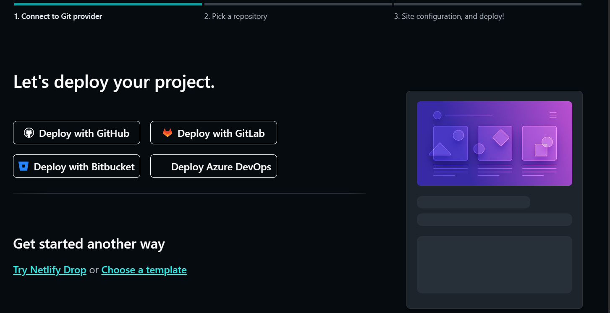

  <h1>Deploying Website with Custom Domain on Netlify</h1>
  
By Andra Dwikasa

  

Hey there! 👋🏻 I'm Andra, and I created this documentation about deploying a website with a custom domain on Netlify as my assignment for RevoU.

This documentation will guide you through the process of deploying your website to Netlify using a custom domain, configuring DNS settings using Cloudflare, and purchasing a domain from Niaga Hoster. By following these steps, you'll be able to set up a deployment workflow using Git flow, register your domain, and manage DNS records for your domain.

## Table of Contents
- [Table of Contents](#table-of-contents)
- [Prerequisites](#prerequisites)
- [Steps](#steps)
  - [Step 1: Deployment with Git Flow](#step-1-deployment-with-git-flow)
  - [Step 2: Purchase a Domain from Niaga Hoster](#step-2-purchase-a-domain-from-niaga-hoster)
  - [Step 3: Deploy Website to Netlify](#step-3-deploy-website-to-netlify)
  - [Step 4: Set up Custom Domain in Netlify](#step-4-set-up-custom-domain-in-netlify)
  - [Step 5: Configure DNS using Cloudflare](#step-5-configure-dns-using-cloudflare)
  - [Step 6: Verify and Finalize](#step-6-verify-and-finalize)

## Prerequisites

Before you get started, make sure you have the following:

- A computer with internet access
- An account on Netlify (`https://www.netlify.com/`)
- An account on Cloudflare (`https://www.cloudflare.com/`)
- A Git repository set up for your website

## Steps

### Step 1: Deployment with Git Flow

If you're using Git for version control, you can set up a deployment workflow using Git flow. Here's an example of the workflow:

1. Create a new branch for your changes: `git checkout -b feature/my-changes`

2. Make your desired changes to your website files.

3. Commit your changes: `git commit -m "Add new features"`

4. Push the changes to your Git repository: `git push origin feature/my-changes`

5. Open a pull request on your repository's hosting platform (e.g., GitHub, GitLab).

6. Once the pull request is approved, merge it to the `main` branch.

7. Netlify will automatically detect the changes and trigger a new deployment based on the merged changes.

### Step 2: Purchase a Domain from Niaga Hoster

1. Go to the Niaga Hoster website (`https://www.niagahoster.co.id/`) and log in to your account.

2. Search for an available domain name using the provided search bar.

   

3. Select the desired domain from the search results and proceed to the checkout page.

   

4. Follow the on-screen instructions to complete the domain registration process, providing the necessary information and making the payment.

   

### Step 3: Deploy Website to Netlify

1. Log in to your Netlify account.

2. On the Netlify dashboard, click on "New site from Git."

   

3. Connect your Git repository or drag and drop your website files to the designated area.

   

4. Configure the build settings according to your project requirements.

   

5. Once the build configuration is complete, your website is deployed on Netlify.

   

### Step 4: Set up Custom Domain in Netlify

1. After the deployment is complete, click on the "Site settings" button for your deployed site.

2. In the settings menu, navigate to "Domain management."

   

3. In the "Custom domains" section, click on "Add custom domain."

   

4. Enter your purchased domain from Niaga Hoster (e.g., `andradwikasa.site`) and click "Save."

   

5. Netlify will provide you with DNS configuration instructions. Make sure to note them down for the next step.

### Step 5: Configure DNS using Cloudflare

1. Log in to your Cloudflare account.

2. On the Cloudflare dashboard, click on "Add a site" to add your domain.

   

3. Enter your domain name (e.g., `andradwika.site`) and click on "Add site."

   

4. Cloudflare will scan your DNS records. Once the scan is complete, click on "Next."

   

5. Review the DNS records found by Cloudflare. Make any necessary changes and click on "Continue."

   

6. Choose the free plan or the desired plan level, and click on "Confirm plan."

7. Cloudflare will provide you with two nameservers. Take note of them.

   

8. Go to your Niaga Hoster account and find the DNS management or nameserver configuration section.

   

9. Replace the existing nameservers with the ones provided by Cloudflare and save the changes.

   

### Step 6: Verify and Finalize

1. Return to your Netlify account and navigate to the "Domain management" section for your site.

2. Click on "Verify DNS configuration."

   

3. Netlify will perform a DNS lookup to verify the changes.

4. Once the DNS configuration is verified, click on "Set up SSL" to enable HTTPS for your domain.

5. Netlify will automatically provision an SSL certificate for your domain.

6. Wait for the SSL certificate provisioning process to complete.

7. Congratulations! Your website should now be live and accessible through your custom domain.

That's it! You've successfully deployed your website to Netlify using a custom domain, configured DNS settings using Cloudflare, and purchased a domain from Niaga Hoster. Enjoy your new website! 🚀
